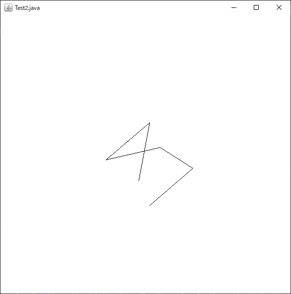

# simple-Wireframe-App
 A program that displays a simple wireframe from an array of coordinates.The application consists only of the standard java libraries, so there is no need to install new external packages.
## How to use
After duplicating the repository, run Test2.java to launch the sample window.

# 簡易ワイヤーフレーム表示アプリ
座標の配列を入力することで，ワイヤーフレームを表示させることができます．
また，アプリケーションはjavaの標準ライブラリのみで構成されるため，外部のパッケージを新たにインストールする必要はありません．
## 使用方法
リポジトリを複製した後，Test2.javaを実行することでサンプルのウィンドウが起動します．

